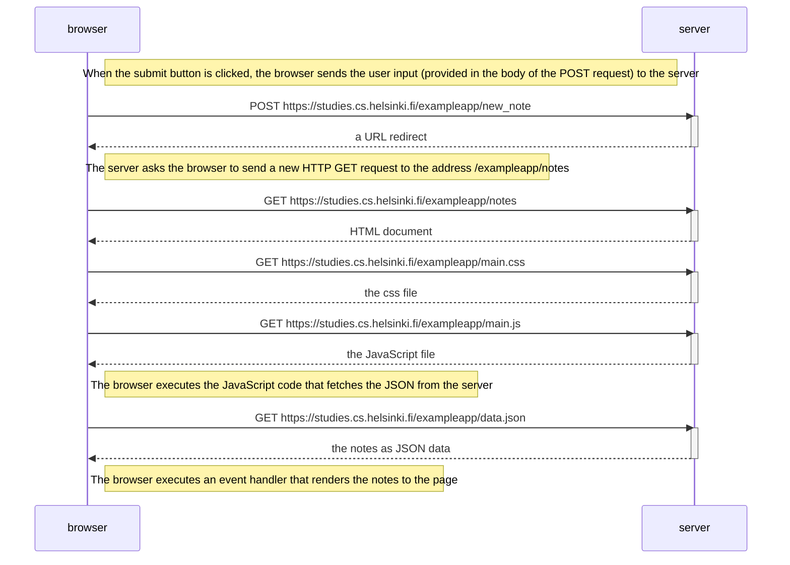

```mermaid
sequenceDiagram
participant browser
participant server

    Note right of browser: When the submit button is clicked, the browser sends the user input (provided in the body of the POST request) to the server

    browser->>server: POST https://studies.cs.helsinki.fi/exampleapp/new_note
    activate server
    server-->>browser: a URL redirect
    deactivate server

    Note right of browser: The server asks the browser to send a new HTTP GET request to the address /exampleapp/notes

    browser->>server: GET https://studies.cs.helsinki.fi/exampleapp/notes
    activate server
    server-->>browser: HTML document
    deactivate server

    browser->>server: GET https://studies.cs.helsinki.fi/exampleapp/main.css
    activate server
    server-->>browser: the css file
    deactivate server

    browser->>server: GET https://studies.cs.helsinki.fi/exampleapp/main.js
    activate server
    server-->>browser: the JavaScript file
    deactivate server

    Note right of browser: The browser executes the JavaScript code that fetches the JSON from the server

    browser->>server: GET https://studies.cs.helsinki.fi/exampleapp/data.json
    activate server
    server-->>browser: the notes as JSON data
    deactivate server

    Note right of browser: The browser executes an event handler that renders the notes to the page
```
