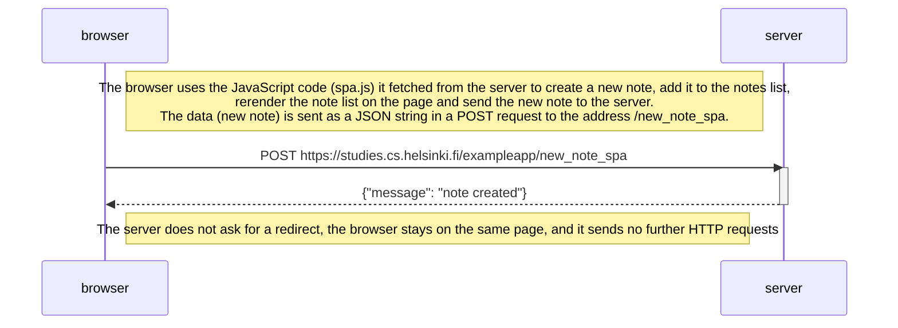

```mermaid
sequenceDiagram
participant browser
participant server

    Note right of browser: The browser uses the JavaScript code (spa.js) it fetched from the server to create a new note, add it to the notes list, <br/> rerender the note list on the page and send the new note to the server. <br/> The data (new note) is sent as a JSON string in a POST request to the address /new_note_spa.

    browser->>server: POST https://studies.cs.helsinki.fi/exampleapp/new_note_spa
    activate server
    server-->>browser: {"message": "note created"}
    deactivate server

    Note right of browser: The server does not ask for a redirect, the browser stays on the same page, and it sends no further HTTP requests
```
